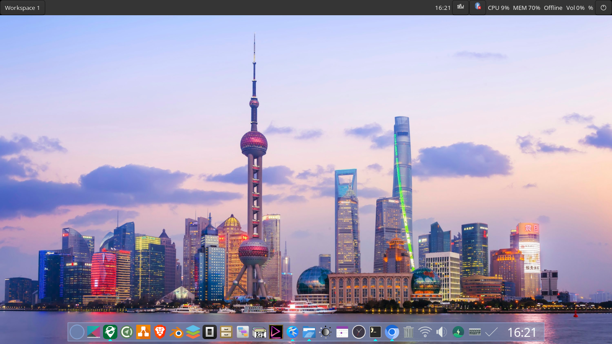

# labwc + sfwbar + crystal-dock



A complete Wayland desktop environment built on **labwc** (Openbox-inspired compositor), **sfwbar** (GTK3-native statusbar/taskbar), and **crystal-dock** (Wayland dock). Ships with interactive theme management, 40+ automation scripts, a C-based widget system, and a full GTK3/GTK4 theming pipeline.

---

## Upstream Projects

### Core Desktop

| Component | Repository | Description |
|-----------|------------|-------------|
| **labwc** | [github.com/labwc/labwc](https://github.com/labwc/labwc) | Openbox-inspired Wayland compositor using wlroots |
| **sfwbar** | [github.com/LBCrion/sfwbar](https://github.com/LBCrion/sfwbar) | GTK3-based flexible taskbar/panel for Wayland compositors |
| **crystal-dock** | [github.com/nicoh88/crystal-dock](https://github.com/nicoh88/crystal-dock) | Wayland dock with smooth animations and icon support |
| **wlroots** | [gitlab.freedesktop.org/wlroots/wlroots](https://gitlab.freedesktop.org/wlroots/wlroots) | Modular Wayland compositor library (labwc dependency) |

### Runtime Tools

| Component | Repository | Description |
|-----------|------------|-------------|
| **foot** | [codeberg.org/dnkl/foot](https://codeberg.org/dnkl/foot) | Fast, lightweight Wayland terminal emulator |
| **rofi** / **rofi-wayland** | [github.com/lbonn/rofi](https://github.com/lbonn/rofi) | Application launcher, window switcher (Wayland fork) |
| **swaybg** | [github.com/swaywm/swaybg](https://github.com/swaywm/swaybg) | Wallpaper setter for Wayland |
| **grim** | [sr.ht/~emersion/grim](https://sr.ht/~emersion/grim) | Screenshot tool for Wayland |
| **slurp** | [github.com/emersion/slurp](https://github.com/emersion/slurp) | Region selector for Wayland (pairs with grim) |
| **wl-clipboard** | [github.com/bugaevc/wl-clipboard](https://github.com/bugaevc/wl-clipboard) | Clipboard utilities for Wayland (`wl-copy`, `wl-paste`) |
| **cliphist** | [github.com/sentriz/cliphist](https://github.com/sentriz/cliphist) | Clipboard history manager for Wayland |
| **playerctl** | [github.com/altdesktop/playerctl](https://github.com/altdesktop/playerctl) | MPRIS media player controller |

### Notifications & Screen Protection

| Component | Repository | Description |
|-----------|------------|-------------|
| **mako** | [github.com/emersion/mako](https://github.com/emersion/mako) | Lightweight Wayland notification daemon |
| **dunst** | [github.com/dunst-project/dunst](https://github.com/dunst-project/dunst) | Notification daemon (alternative to mako) |
| **gammastep** | [gitlab.com/chinstrap/gammastep](https://gitlab.com/chinstrap/gammastep) | Screen color temperature adjuster (Wayland-native) |
| **redshift** | [github.com/jonls/redshift](https://github.com/jonls/redshift) | Screen temperature adjuster (alternative to gammastep) |
| **swayidle** | [github.com/swaywm/swayidle](https://github.com/swaywm/swayidle) | Idle management daemon for Wayland |
| **swaylock** | [github.com/swaywm/swaylock](https://github.com/swaywm/swaylock) | Screen locker for Wayland |

### Desktop Integration

| Component | Repository | Description |
|-----------|------------|-------------|
| **blueman** | [github.com/blueman-project/blueman](https://github.com/blueman-project/blueman) | Bluetooth manager with system tray |
| **brightnessctl** | [github.com/Hummer12007/brightnessctl](https://github.com/Hummer12007/brightnessctl) | Backlight brightness control |
| **NetworkManager** | [gitlab.freedesktop.org/NetworkManager](https://gitlab.freedesktop.org/NetworkManager/NetworkManager) | Network management (used via `nmcli` and tray applet) |
| **xdg-desktop-portal-wlr** | [github.com/emersion/xdg-desktop-portal-wlr](https://github.com/emersion/xdg-desktop-portal-wlr) | XDG desktop portal for wlroots compositors |

### Build Toolchain

| Component | Repository | Description |
|-----------|------------|-------------|
| **meson** | [github.com/mesonbuild/meson](https://github.com/mesonbuild/meson) | Build system used by labwc, sfwbar, and C components |
| **ninja** | [github.com/ninja-build/ninja](https://github.com/ninja-build/ninja) | Fast build executor (meson backend) |
| **cairo** | [cairographics.org](https://www.cairographics.org/) | 2D graphics library (C widget rendering) |
| **pango** | [pango.gnome.org](https://pango.gnome.org/) | Text layout and rendering (C widget text) |
| **wayland-protocols** | [gitlab.freedesktop.org/wayland/wayland-protocols](https://gitlab.freedesktop.org/wayland/wayland-protocols) | Wayland extension protocol definitions |

## Quick Start

```bash
# 1. Build labwc from source
./download-labwc.sh --install

# 2. Install all dotfiles (with backup)
./dotfiles/install.sh

# 3. Launch from TTY
./scripts/start-labwc.sh
```

Or use the interactive reconfigure CLI:
```bash
./scripts/reconfigure.sh
```

---

## What's Included

### Core Components

| Component | Role | Config Location |
|-----------|------|-----------------|
| **labwc** | Wayland compositor (Openbox-inspired) | `~/.config/labwc/` |
| **sfwbar** | GTK3-native statusbar/taskbar/panel | `~/.config/sfwbar/` |
| **crystal-dock** | Wayland dock | autostart |
| **foot** | Wayland terminal | keybindings |
| **rofi** | Application launcher | keybindings |
| **swaybg** | Wallpaper setter | autostart |

### Feature Set

- **Interactive theme picker** — 10+ predefined themes with color previews
- **GTK3/GTK4 theming** — Full settings, CSS overrides, cursor/icon/font management
- **Font system** — UI, monospace, CJK, Nerd Fonts with profile-based install
- **Wallpaper manager** — Random rotation, download sources, daemon mode
- **40+ automation scripts** — Backup, restore, validate, fix, diagnostics
- **Action scripts** — Screenshot, clipboard, audio, brightness, power menu
- **Keybinding presets** — Multiple layout options
- **Widget system** — SFWBar text widgets + HTML widget themes
- **C-based component system** — Native Wayland widgets via wlr-layer-shell (experimental)
- **Statusbar configurator** — Swappable bar layouts (main, compact, detailed, minimalist)

---

## Project Structure

```
labwc-crystaldock-barandwidgets/
├── README.md                          # This file
├── download-labwc.sh                  # Build labwc from source
│
├── config/                            # Reference config copies
│   ├── labwc/                         # labwc reference configs
│   │   ├── rc.xml                     # Keybindings & window rules
│   │   ├── autostart                  # Startup commands
│   │   ├── environment                # Environment variables
│   │   ├── menu.xml                   # Desktop right-click menu
│   │   ├── themerc-override           # Window decoration theme
│   │   └── startup-wallpaper.sh       # Wallpaper launcher
│   └── zebar/                         # Zebar reference (legacy, not default)
│
├── dotfiles/                          # Installable configuration
│   ├── install.sh                     # Main installer (369 lines)
│   ├── README.md                      # Dotfiles documentation
│   ├── labwc/                         # labwc config files
│   │   ├── rc.xml                     # 100+ keybindings, window rules
│   │   ├── autostart                  # Shell script (sfwbar, wallpaper, dock, etc.)
│   │   ├── environment                # Wayland/GTK/Qt env vars
│   │   ├── menu.xml                   # Desktop menu with 15+ entries
│   │   ├── themerc-override           # Window decoration colors
│   │   ├── startup-wallpaper.sh       # Random wallpaper via swaybg
│   │   └── presets/                   # Keybinding presets
│   │       ├── default.xml
│   │       └── super.xml
│   ├── sfwbar/                        # SFWBar statusbar config (default panel)
│   │   ├── sfwbar.config              # Main config (241 lines): pager, clock, tray, widgets
│   │   ├── sfwbar-simple.config       # Minimal config (47 lines)
│   │   ├── catppuccin-mocha.css       # GTK CSS theme (156 lines)
│   │   ├── cpu-text.widget            # CPU usage label
│   │   ├── memory-text.widget         # Memory usage label
│   │   ├── network-text.widget        # Network status label
│   │   ├── volume-text.widget         # Volume indicator
│   │   └── battery-text.widget        # Battery level
│   ├── gtk/                           # GTK3/GTK4 theme configuration
│   │   ├── gtk3-settings.ini          # GTK3 theme, icons, cursor, fonts
│   │   ├── gtk4-settings.ini          # GTK4 theme settings
│   │   ├── gtk.css                    # CSS overrides (rounded corners, etc.)
│   │   └── theme-profiles/            # 7 predefined GTK theme profiles
│   │       ├── catppuccin-mocha
│   │       ├── catppuccin-macchiato
│   │       ├── nordic
│   │       ├── arc-dark
│   │       ├── breeze / breeze-dark
│   │       └── pocillo-dark
│   ├── zebar/                         # Zebar widget configuration (legacy fallback)
│   │   ├── main/                      # Primary statusbar (HTML/CSS/JS)
│   │   │   ├── index.html             # Full statusbar with providers
│   │   │   ├── style.css              # Catppuccin Mocha theme
│   │   │   └── zpack.json             # Widget pack manifest
│   │   ├── settings.json             (legacy Zebar startup config)
│   │   ├── launcher.sh                # Widget launcher script
│   │   └── widgets/                   # Alternative widget themes
│   │       ├── compact/               # Space-optimized bar
│   │       ├── detailed/              # 3x2 grid dashboard
│   │       ├── minimalist/            # Gradient background
│   │       └── system/                # Full system monitor
│   ├── wallpaper                      # Wallpaper manager script (141 lines)
│   └── wallpaper-sources.txt          # 22 Unsplash download URLs
│
├── scripts/                           # 30 automation scripts + 10 actions
│   ├── reconfigure.sh                 # Interactive CLI (main entry point)
│   ├── setup.sh                       # First-time full setup
│   ├── setup-sfwbar.sh                # Install and configure SFWBar
│   ├── start-labwc.sh                 # Launch with pre-flight checks
│   ├── start-redshift.sh              # Start screen protection
│   ├── start-simple-panel.sh          # Start sfwbar with minimal config
│   ├── validate.sh                    # 8-category validation
│   ├── fix.sh                         # Auto-fix permissions, symlinks, config
│   ├── status.sh                      # Live status dashboard
│   ├── diagnostics.sh                 # Deep system report
│   ├── backup.sh                      # Timestamped backup with rotation
│   ├── restore.sh                     # Restore from backup (with dry-run)
│   ├── clean.sh                       # Clean build artifacts
│   ├── update.sh                      # Update labwc from source
│   ├── install-deps.sh                # Auto-detect distro and install deps
│   ├── quick.sh                       # Shortcuts for common ops
│   ├── dotfiles-sync.sh               # Two-way sync dotfiles ↔ ~/.config/labwc
│   ├── theme-picker.sh                # Interactive visual theme picker
│   ├── theme.sh                       # Theme manager (apply GTK/labwc/cursor)
│   ├── themes.sh                      # Unified theme CLI
│   ├── download-themes.sh             # Download GTK/icon/cursor/font resources
│   ├── keybinds.sh                    # View/add/remove keybindings
│   ├── keybind-presets.sh             # Keybinding preset manager
│   ├── widget-manager.sh              # C-based widget/statusbar manager
│   ├── widget-actions.sh              # Widget action scripts
│   ├── actions.sh                     # Unified action entry point
│   ├── relaunch-status-bars.sh        # Restart sfwbar and crystal-dock
│   ├── test-components.sh             # Test C-based widget components
│   ├── toggle-natural-scroll.sh       # Toggle touchpad natural scroll
│   └── actions/                       # Individual action scripts
│       ├── audio.sh                   # Volume, mute, sink switch
│       ├── brightness.sh              # Brightness control
│       ├── clipboard.sh               # Clipboard manager
│       ├── launcher.sh                # Apps, calc, emoji, color picker
│       ├── network.sh                 # WiFi/BT toggle, status
│       ├── power-menu.sh              # Shutdown, reboot, logout
│       ├── quick-settings.sh          # Dark mode, DND, night mode
│       ├── screenshot.sh              # Full/area/window screenshots
│       ├── window.sh                  # Snap, float, fullscreen
│       └── workspace.sh               # Switch/move workspaces
│
├── components/                        # C-based Wayland-native widget system
│   ├── README.md                      # Component documentation
│   ├── meson.build                    # Build system (meson)
│   ├── registry.json                  # Component manifest
│   ├── libwidget/                     # Shared C library
│   │   ├── include/widget.h           # Public API (326 lines)
│   │   ├── widget.c                   # Core implementation (258 lines)
│   │   ├── providers/                 # System data providers (CPU, memory, etc.)
│   │   ├── wayland/                   # wlr-layer-shell integration
│   │   └── render/                    # Cairo/Pango rendering helpers
│   ├── widgets/                       # Individual widget implementations
│   │   ├── clock/clock.c              # Real-time clock with date
│   │   ├── cpu/cpu.c                  # CPU usage monitor
│   │   ├── memory/memory.c            # Memory usage monitor
│   │   ├── network/network.c          # Network status
│   │   ├── battery/battery.c          # Battery monitor
│   │   ├── volume/volume.c            # Audio volume
│   │   └── workspaces/workspaces.c    # Workspace switcher
│   ├── statusbars/                    # Complete statusbar compositions
│   │   ├── framework.c                # Unified statusbar framework (415 lines)
│   │   ├── core.c                     # Common framework (216 lines)
│   │   ├── main/main.c                # Full-featured statusbar (326 lines)
│   │   ├── compact/compact.c          # Space-optimized bar (190 lines)
│   │   └── panel/panel.c              # Grid dashboard (308 lines)
│   ├── dock/                          # Dock configurations
│   │   ├── crystal/manifest.json      # Crystal dock config
│   │   └── none/manifest.json         # No dock
│   ├── docks/                         # Dock implementations
│   │   └── crystal/crystal-dock.c     # Crystal Wayland dock (225 lines)
│   ├── widgets-system/                # Widget system core
│   │   └── widgets-system.c           # Widget lifecycle (515 lines)
│   └── shared/                        # Shared resources
│       ├── base-theme.c               # Theme initialization (88 lines)
│       └── base.css                   # CSS variables for all themes (184 lines)
│
├── statusbar-configs/                 # Statusbar schema configs
│   ├── README.md                      # Template documentation
│   ├── main.conf                      # Full-featured bar (32px, all widgets)
│   ├── compact.conf                   # Compact bar (24px, essential widgets)
│   ├── detailed.conf                  # Detailed bar (40px, 3x2 grid)
│   └── minimalist.conf               # Minimal bar (20px, clock only)
│
├── widget-configs/                    # Widget schema configs
│   ├── README.md                      # Schema documentation
│   ├── clock.json                     # Clock widget config
│   ├── workspaces.json                # Workspace switcher config
│   ├── system.json                    # System bundle (CPU/MEM/NET/BAT/VOL)
│   ├── detailed.json                  # Detailed 3x2 grid config
│   └── minimalist.json                # Minimal clock-only config
│
├── systems/                           # C cross-cutting concerns
│   ├── README.md                      # System documentation
│   ├── config.c                       # Config loading, validation, migration
│   ├── theme.c                        # Theme management and rendering
│   ├── lifecycle.c                    # Event system (START/STOP/UPDATE/RENDER)
│   ├── navigation.c                   # Workspace & window management
│   ├── focus.c                        # Cross-component focus management
│   ├── preference.c                   # User preferences store
│   └── transition.c                   # System registry & hot-reload
│
├── themes/                            # Theme profile definitions
│   ├── catppuccin-mocha.ini           # Warm pastel dark
│   ├── dracula.ini                    # Purple accent dark
│   ├── nord.ini                       # Arctic blue
│   └── tokyo-night.ini               # Neon blue/purple
│
├── widgets/                           # Enhanced HTML widget themes
│   ├── main/                          # Basic statusbar (workspaces, clock, battery, CPU, memory)
│   ├── compact/                       # Compact bar (Tailwind, clock, CPU, memory, network)
│   ├── detailed/                      # 6-column dashboard (Tailwind, all system metrics)
│   └── minimalist/                    # Minimal gradient (JetBrains Mono)
│
├── docs/                              # Documentation
│   ├── configuration.md               # Full keybinding reference, config files, themes
│   └── getting-started.md             # Setup guide, prerequisites, troubleshooting
│
└── .gitignore                         # Ignores: build/, *.deb, *.tar.gz, *.log, node_modules/
```

---

## Scripts Reference

### Main Entry Points

| Script | Description |
|--------|-------------|
| `reconfigure.sh` | **Interactive CLI** — menu-driven reconfiguration with backup |
| `setup.sh` | One-shot full setup: deps → build labwc → install config |
| `start-labwc.sh` | Launch labwc with dependency checks |
| `validate.sh` | 8-category validation (binaries, configs, themes, etc.) |
| `fix.sh` | Auto-fix permissions, symlinks, missing configs |

### SFWBar Management

| Script | Description |
|--------|-------------|
| `setup-sfwbar.sh` | Install and configure SFWBar |
| `start-simple-panel.sh` | Start sfwbar with minimal config |
| `relaunch-status-bars.sh` | Restart both sfwbar and crystal-dock |

```bash
# Setup SFWBar
setup-sfwbar.sh

# Start minimal panel
start-simple-panel.sh

# Relaunch status bars
relaunch-status-bars.sh
```

### Theme Management

| Script | Description |
|--------|-------------|
| `theme-picker.sh` | Interactive visual theme picker with color previews |
| `theme.sh` | Theme manager (apply labwc + GTK + cursor + fonts) |
| `themes.sh` | Unified theme CLI (profiles, sets, overrides) |
| `download-themes.sh` | Download GTK/icon/cursor/font resources |

```bash
# Theme picker (interactive)
theme-picker              # or: theme-picker pick

# Quick apply
theme-picker apply catppuccin-mocha

# List themes
theme-picker list

# Download all resources
download-themes.sh all

# Download fonts only
download-themes.sh fonts

# Install font profile
download-themes.sh font-profile dev
```

### Widget & Component Management

| Script | Description |
|--------|-------------|
| `widget-manager.sh` | Manage C-based widget/statusbar components |
| `widget-actions.sh` | Standardized CLI actions for widgets |
| `test-components.sh` | Test C-based widget components |

```bash
# List available components
widget-manager.sh list

# Show current configuration
widget-manager.sh status

# Swap statusbar (C-based)
widget-manager.sh swap statusbar compact
widget-manager.sh swap statusbar main
widget-manager.sh swap statusbar panel

# Swap dock
widget-manager.sh swap dock crystal
widget-manager.sh swap dock none

# Start/stop/restart
widget-manager.sh start
widget-manager.sh stop
widget-manager.sh restart

# Build C components
widget-manager.sh build
widget-manager.sh install
```

### System Management

| Script | Description |
|--------|-------------|
| `backup.sh` | Timestamped backup with rotation |
| `restore.sh` | Restore from backup (with dry-run) |
| `diagnostics.sh` | Deep system report |
| `status.sh` | Live status dashboard |
| `update.sh` | Update labwc from source |
| `install-deps.sh` | Auto-detect distro and install dependencies |
| `clean.sh` | Clean build artifacts, temp files |
| `dotfiles-sync.sh` | Two-way sync dotfiles ↔ ~/.config/labwc |

### Actions

```bash
# Via unified entry point
actions.sh screenshot area
actions.sh audio mute
actions.sh brightness up
actions.sh power-menu
actions.sh clipboard pick
actions.sh network wifi-toggle
actions.sh window snap-left
actions.sh workspace switch 3

# Via quick shortcuts
quick theme-picker
quick theme-apply nord
quick backup
quick validate
quick fix
```

---

## Keybindings

### System
| Key | Action |
|-----|--------|
| `Super+R` | Reload config |
| `Super+Q` / `Alt+F4` | Close window |
| `Super+M` | Exit labwc |

### Launchers
| Key | Action |
|-----|--------|
| `Super+Return` | Terminal (foot) |
| `Alt+D` | App launcher (rofi) |
| `Alt+Tab` | Window switcher |
| `Alt+X` | Run command |
| `Alt+F5` | Power menu |

### Window Management
| Key | Action |
|-----|--------|
| `Alt+E` | Toggle floating |
| `Alt+F` | Toggle fullscreen |
| `Super+A` | Toggle maximize |
| `Alt+Space` | Root menu |
| `Ctrl+Alt+Arrows` | Window snapping |

### Workspaces
| Key | Action |
|-----|--------|
| `Alt+1-9` | Switch workspace |
| `Super+Shift+1-9` | Move window to workspace |
| `Ctrl+Alt+Left/Right` | Next/prev workspace |

### Media
| Key | Action |
|-----|--------|
| `XF86AudioRaise/Lower` | Volume |
| `XF86AudioMute` | Toggle mute |
| `XF86MonBrightness` | Brightness |
| `Print` | Screenshot (area) |
| `Alt+Print` | Screenshot (full) |
| `Ctrl+Shift+V` | Clipboard history |

See [docs/configuration.md](docs/configuration.md) for complete keybinding reference.

---

## Theming

### Theme Profiles

**INI theme profiles** (`themes/`) — full labwc + GTK3/GTK4 + cursor + font definitions:

| Theme | Style | Base | Accent | GTK Theme |
|-------|-------|------|--------|-----------|
| catppuccin-mocha | Warm pastel dark | `#1e1e2e` | `#89b4fa` | Catppuccin-Mocha-Standard-Dark |
| dracula | Purple accent | `#282a36` | `#bd93f9` | Dracula |
| nord | Arctic blue | `#2e3440` | `#88c0d0` | Nordic |
| tokyo-night | Neon blue | `#1a1b26` | `#7aa2f7` | Tokyonight-Dark-BL |

**GTK theme profiles** (`dotfiles/gtk/theme-profiles/`) — GTK-only settings:

| Profile | GTK Theme | Icon Theme |
|---------|-----------|------------|
| arc-dark | Arc-Dark | Papirus-Dark |
| breeze | Breeze | Breeze |
| breeze-dark | Breeze-Dark | Breeze-Dark |
| catppuccin-macchiato | Catppuccin-Macchiato-Mauve | Papirus-Dark |
| catppuccin-mocha | Catppuccin-Mocha-Mauve | Papirus-Dark |
| nordic | Nordic | Papirus-Dark |
| pocillo-dark | Pocillo-dark | Papirus-Dark |

**C component themes** (`components/shared/base-theme.c`) — Cairo rendering themes:

| Theme | Status |
|-------|--------|
| Catppuccin Mocha | Default |
| Nord | Available |
| Dracula | Available |
| Tokyo Night | Available |

### What Gets Themed

- **labwc** — Window decorations (`themerc-override`)
- **GTK3/GTK4** — Theme, icons, cursors, fonts (via `gsettings`)
- **sfwbar** — GTK CSS variables for panel colors
- **C components** — Cairo rendering themes (Catppuccin Mocha, Nord, Dracula, Tokyo Night)
- **Environment** — Cursor theme, font rendering

Note: sfwbar (GTK3-native) is the default statusbar. Zebar (HTML/CSS/JS) widgets are available as legacy fallback but are not started by default.*

```bash
# Interactive picker
theme-picker

# Quick apply
theme-picker apply catppuccin-mocha

# Preview colors
theme-picker preview nord
```

---

## SFWBar Statusbar

The default statusbar is **sfwbar** — a GTK3-based, Wayland-native panel. Configured in `dotfiles/sfwbar/`.

The statusbar includes:
- **Workspace pager** (1-9) with active indicator
- **Real-time clock** with date tooltip
- **System tray**
- **CPU** usage percentage
- **Memory** usage percentage
- **Network** status (WiFi SSID / Ethernet / Offline)
- **Volume** indicator with mute detection
- **Battery** level with charging state
- **Session menu** (lock, logout, reboot, shutdown)

### SFWBar Widget Files

| Widget | File | Description |
|--------|------|-------------|
| CPU | `cpu-text.widget` | "CPU XX%" with tooltip |
| Memory | `memory-text.widget` | "MEM XX%" with tooltip |
| Network | `network-text.widget` | "WiFi SSID" or "Eth" or "Offline" |
| Volume | `volume-text.widget` | "Vol XX%" or "Vol Mute" |
| Battery | `battery-text.widget` | "Bat XX%" |

### Statusbar Configurations

| Config | Height | Widgets | Theme |
|--------|--------|---------|-------|
| `main` | 32px | workspaces, clock, cpu, memory, network, battery, volume | catppuccin-mocha |
| `compact` | 24px | clock, cpu, memory, network | catppuccin-mocha |
| `detailed` | 40px | 3x2 grid: all widgets | nord |
| `minimalist` | 20px | clock only (transparent) | tokyo-night |

---

## C-Based Widget System (Experimental)

A native Wayland widget system using **wlr-layer-shell**, **Cairo**, **Pango**, and **fontconfig**. Located in `components/`.

### Architecture

```
libwidget/          → Shared library (providers, wayland integration, rendering)
widgets/            → Standalone widget binaries (clock, cpu, memory, network, battery, volume, workspaces)
statusbars/         → Composed statusbar binaries (main, compact, panel)
docks/              → Dock implementations (crystal-dock)
systems/            → Cross-cutting concerns (config, theme, lifecycle, navigation, focus, preferences)
shared/             → Theme engine + CSS variables
```

### Building

```bash
# Install dependencies (Ubuntu/Debian)
sudo apt install wayland-protocols libwayland-dev libwlr-dev \
    libcairo2-dev libpango1.0-dev libfontconfig1-dev libxkbcommon-dev

# Build via widget-manager
./scripts/widget-manager.sh build
./scripts/widget-manager.sh install
```

### Usage

```bash
# List available components
./scripts/widget-manager.sh list

# Swap statusbar
./scripts/widget-manager.sh swap statusbar main
./scripts/widget-manager.sh swap statusbar compact
./scripts/widget-manager.sh swap statusbar panel

# Swap dock
./scripts/widget-manager.sh swap dock crystal
./scripts/widget-manager.sh swap dock none

# Start/stop
./scripts/widget-manager.sh start
./scripts/widget-manager.sh stop
./scripts/widget-manager.sh restart
```

### Widget Configurations

Widget schemas are defined in `widget-configs/`:

| Widget | Type | Description |
|--------|------|-------------|
| `clock` | standard | 24h clock, Nerd Font, center |
| `workspaces` | standard | 9 workspaces, click-to-switch, fade animation |
| `system` | bundle | CPU, memory, network, battery, volume |
| `detailed` | detailed | 3x2 grid with all widgets + tray + weather |
| `minimalist` | minimal | Clock only, transparent, subtle text |

### Theme Support

Built-in themes in `components/shared/`:
- Catppuccin Mocha (default)
- Nord
- Dracula
- Tokyo Night

---

## Installation

### Prerequisites

- **labwc** — Build with `./download-labwc.sh` or install via package manager
- **sfwbar** — GTK3-native Wayland statusbar (primary panel)
- **crystal-dock** — Wayland dock
- **foot** — Wayland terminal
- **rofi** — Application launcher
- **swaybg** — Wallpaper setter

### Install Dependencies

```bash
./scripts/install-deps.sh
```

### Install Dotfiles

```bash
./dotfiles/install.sh
```

This installs:
 - labwc config → `~/.config/labwc/` (rc.xml, autostart, environment, menu.xml, themerc-override)
 - SFWBar config → `~/.config/sfwbar/` (sfwbar.config, CSS, widget files)
 - GTK3/GTK4 settings → `~/.config/gtk-3.0/` and `~/.config/gtk-4.0/`
 - Scripts → `~/.local/bin/` (including `actions/` subdirectory)
- Wallpaper script → `~/.local/bin/wallpaper`
- Session file → `/usr/share/wayland-sessions/labwc.desktop`

### Launch

```bash
# From TTY (Ctrl+Alt+F2)
./scripts/start-labwc.sh

# Or select labwc from display manager
```

---

## Backup & Restore

```bash
# Create backup
backup.sh

# List backups
restore.sh

# Restore from latest
restore.sh

# Restore specific backup
restore.sh 20260703-120000
```

Backups are stored in `~/.config/labwc-backups/` with automatic rotation (keeps last 5).

---

## Documentation

- [Configuration Guide](docs/configuration.md) — Full keybinding reference, config files, themes
- [Getting Started](docs/getting-started.md) — Setup guide, prerequisites, troubleshooting
- [Components](components/README.md) — C-based widget system documentation
- [Statusbar Configs](statusbar-configs/README.md) — Statusbar schema templates
- [Widget Configs](widget-configs/README.md) — Widget schema documentation
- [Systems](systems/README.md) — Cross-cutting C concerns (config, theme, lifecycle, navigation, focus, preferences)

---

## License

This project is provided as-is for personal use.
